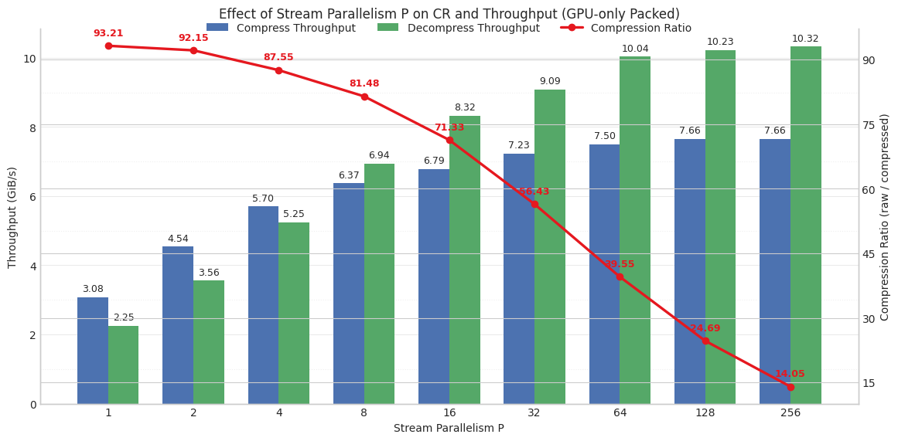

---

## Build
```bash
pip install -e . --no-build-isolation
````

---

## Overview

This project extends **CompressAI** with **GPU-oriented acceleration** and **end-to-end compression system co-design** for **scientific image data**.

The repository implements an **AI-based scientific image compression workflow** that spans:

* domain-specific model training or fine-tuning,
* low-precision inference optimization,
* GPU-based entropy coding,
* and fully symmetric decompression,

with a strong focus on **end-to-end throughput optimization via inference–encoding co-design**.

---

## Legend Extensions (Added Features)

### 1) Low-Precision Acceleration for CNN-Based Compression Models

We introduce low-precision inference acceleration for **CNN-based learned compression models** using:

* **TensorRT (TRT)**
* a **model optimization / quantization framework**

Supported numeric formats include:

* **FP32 / FP16 / FP8**
* End-to-end compression and decompression acceleration
* Unified benchmarking of **throughput vs. reconstruction quality**

These optimizations significantly improve inference throughput while preserving rate–distortion (RD) behavior on scientific datasets.

---

### 2) Integrated GPU Lossless Compression Pipeline

We integrate a **GPU-based lossless compression pipeline**, organized into three stages:

1. **Normalizer**
   Performs data normalization or transformation to improve quantization efficiency and entropy coding suitability.

2. **Quantizer**
   Discretizes transformed data into integer symbols.

3. **Lossless Encoding**
   Applies **GPU-based entropy coding** to produce a compact bitstream.
   The decoding process is fully symmetric and lossless.

This pipeline can be used:

* independently as a standalone GPU compressor, or
* jointly with learned compression models as a post-processing stage.

---

### 3) P-Controlled GPU Long-Integer Encoding (NEW)

We introduce a **P-control mechanism** for GPU-based long-integer entropy coding, designed specifically for **32-bit latent representations** produced by CNN-based compression models.

#### 3.1) Key Features

- **P-controlled parallel granularity** for GPU encoding
- **High-throughput** entropy coding on GPU
- **Minimal compression-ratio (CR) degradation**


#### 3.2) Parallelization Strategy (Current Implementation)

Our current P-control GPU ANS encoder uses a **channel-grouped chunking** strategy.

**Data layout**

- The latent tensor is flattened as:
  - `N = C * H * W`
  - `HW = H * W`
- The P-control parameter **P** is interpreted as **Pch** (channels per chunk).

**Chunking**

- The stream is split into:
  - `K = ceil(C / Pch)`
- Each chunk covers:
  - `chunk_len = Pch * HW`
  contiguous symbols in the flattened layout.

**GPU mapping**

- **One CUDA block per batch element**  
  - `blockIdx.x = b`
- **One CUDA thread per chunk**  
  - `chunk_id`
- Each thread independently runs a full **rANS encoder/decoder** for its chunk, producing an **independent chunk bitstream**.
- Chunk bitstreams are concatenated into a single packed buffer using a **tight header layout**.

**Tradeoff controlled by `Pch`**

- **Smaller `Pch` → larger `K`**
  - Higher parallelism and throughput
  - Higher per-chunk overhead
- **Larger `Pch` → smaller `K`**
  - Higher compression ratio
  - Lower parallelism

#### 3.3) GPU Optimizations (Current)

The current CUDA implementation applies the following optimizations:

1. **Fast-path index elimination (channel index inference)**
   - Detects whether `indexes[b, i]` equals the channel id (constant within each `HW` region).
   - If true, computes `cdf_idx = i / HW` directly and avoids reading `indexes` during encode/decode, reducing global memory traffic.

2. **CDF / offset cache within a chunk**
   - Within each chunk thread, caches the last-used `(cdf_idx, cdf_ptr, cdf_size, offset)` to avoid redundant global memory loads when consecutive symbols share the same distribution.


#### 3.4) P-Control Encoding Performance

The following figure compares **throughput and compression ratio (CR)** of the proposed P-control GPU encoder against CPU-based and nvCOMP baselines on latent data:



This result demonstrates that P-control enables **substantially higher GPU encoding throughput** while maintaining competitive compression ratios.

---

## Benchmarks

### Metrics

The following metrics are reported across all experiments:

* **Throughput (Enc / Dec)**
  End-to-end compression and decompression throughput (GB/s).

* **RMSE / NRMSE**
  Reconstruction error metrics.

* **PSNR (dB)**
  Peak Signal-to-Noise Ratio.

* **CR (Compression Ratio)**
  Defined as:

  ```
  CR = original size / compressed size
  ```

> **Note:** For fair comparison, dataset, input resolution, batch size, GPU model, and software stack are kept consistent across all precision modes.

---

## Experimental Results

### A) End-to-End Performance and Quality

#### [min-max norm + eb-quant + bitcomp]
| Precision | Encoding Throughput (GB/s) | Decoding Throughput (GB/s) | GA Thr (GB/s) | ENC Thr (GB/s) | GS Thr (GB/s) | DEC Thr (GB/s) |  RMSE  |  NRMSE  |  PSNR (dB)  |   maxe  |    CR    |
| --------- | -------------------------: | -------------------------: | ------------: | -------------: | ------------: | -------------: | -----: | ------: | ----------: | ------: | -------: |
| FP32      |                      5.36  |                      4.91  |       —       |        —       |       —       |        —       | 0.1017 | 0.10205 |        13.8 |  0.8845 |  79.217  |
| FP16      |                     15.99  |                     10.40  |       18.77      |       115.14       |       103.76       |        11.45       | 0.1017 | 0.10206 |        13.8 |  0.8871 |  79.266  |
| FP8       |                     20.12  |                      9.12  |     24.26     |     118.70     |    103.92     |      9.83     | 0.1018 | 0.10219 |       13.79 |  0.8900 |  77.393  |

---

#### [original quant + gpuANS(P=64)]
| Precision | Encoding Throughput (GB/s) | Decoding Throughput (GB/s) | GA Thr (GB/s) | ENC Thr (GB/s) | GS Thr (GB/s) | DEC Thr (GB/s) |  RMSE  |  NRMSE  |  PSNR (dB)  |   maxe  |    CR    |
| --------- | -------------------------: | -------------------------: | ------------: | -------------: | ------------: | -------------: | -----: | ------: | ----------: | ------: | -------: |
| FP32      |                      5.36  |                      4.91  |       —       |        —       |       —       |        —       | 0.1017 | 0.10205 |        13.8 |  0.8845 |  79.217  |
| FP16      |                     11.19  |                     8.60  |       19.34       |        5.82       |       7.58       |        12.03       | 0.105244 | 0.105659 |        13.5 |  0.903641 |  158.191  |
| FP8       |                     12.88  |                      7.22  |     24.26     |     5.89     |    7.67     |      10.36     | 0.105359 | 0.105774 |       13.49 |  0.924759 |  157.686  |

---

### B) Experimental Setup

| Item                     | Value               |
| ------------------------ | ------------------- |
| Dataset / Input          | NYX                 |
| Input Resolution / Shape | 512 × 3 × 128 × 128 |
| GPU                      | NVIDIA H100         |
| CUDA / Driver            | 12.6                |
| TensorRT                 | 10.13.2.6           |
| Quantization Framework   | Model Optimization  |

---

## Reproducibility

Example command for building TensorRT engines and running end-to-end benchmarks:

```bash
python CompressAI-Science/compressai/runtime/examples/runtime_cnn_trt_fp8.py
```

All experiments reported in this repository can be reproduced using the provided scripts and configuration files.


---
